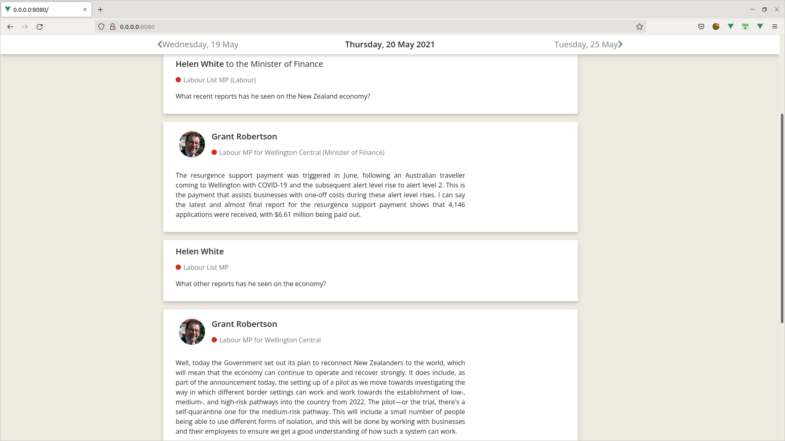
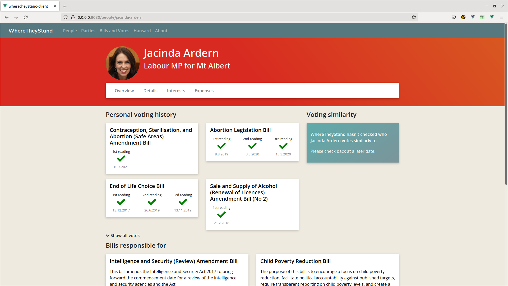
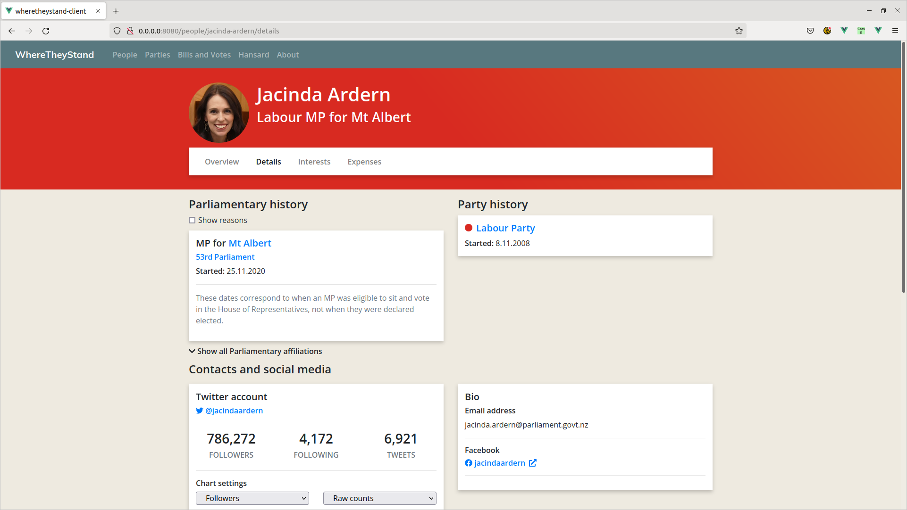
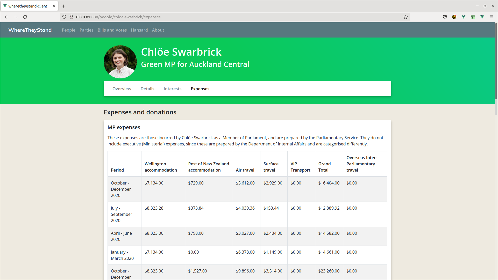
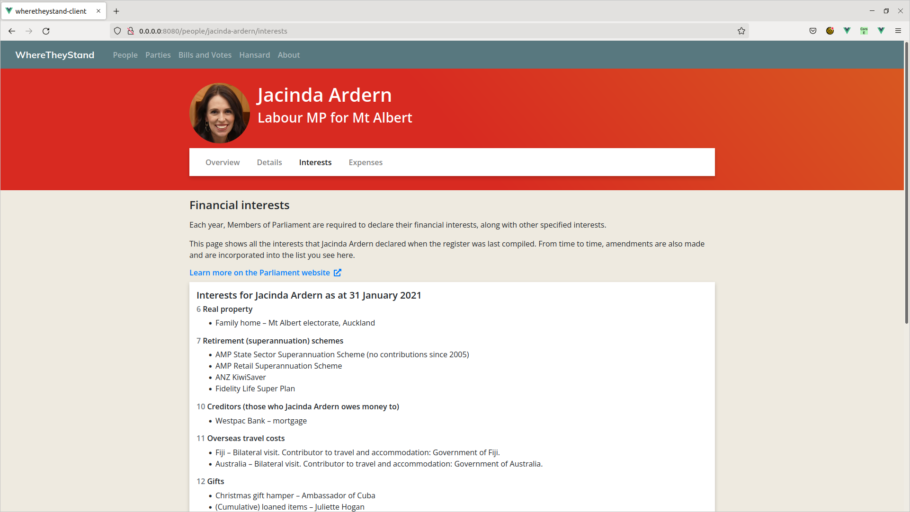
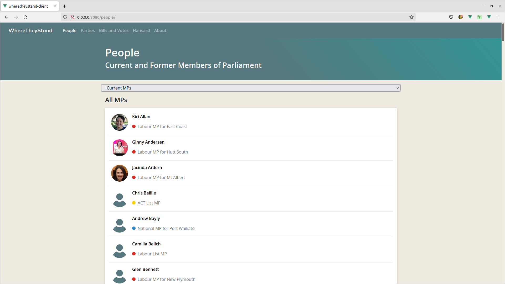

# wheretheystand-client
This Vue app is an under-development client for WhereTheyStand ([https://wheretheystand.nz](https://wheretheystand.nz)). This app is intended to fully replace the current front-end user interface for WhereTheyStand at some point in early 2022. It is not currently live.

## Preview
Here are some examples of the new design for WhereTheyStand:

### Hansard reader



### Person overview



### Person details



### Person expenses



### Person financial interests



### MP directory



## Project setup
```
npm install
```

### Compiles and hot-reloads for development
```
npm run serve
```

### Compiles and minifies for production
```
npm run build
```

### Lints and fixes files
```
npm run lint
```

### Customize configuration
See [Configuration Reference](https://cli.vuejs.org/config/).
